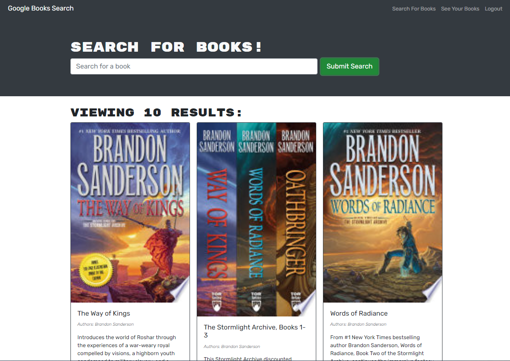

# Google Book Search

## Description

Are you an avid reader? Do you have a list of books that you want to buy and/or read? Do you keep forgetting what books are on that list? This app can help you organize that ever growing list for you. You can signup and search for a book and then add that book to your saved books so you never forget what books you wanted to read again. Then when you're finished reading it, you can delete the book from your list.

## Installation

To install this app, clone the repositiory from github and run `npm install` from the root folder to install the necessary packages. However, since this app is deployed on heroku, no installation is necessary.

## Usage

If the files were installed you can run `npm run develop` to start the app locally in a browser window. Alternatively, you can click [this link](https://shielded-depths-21762.herokuapp.com/) to open the deployed heroku application. Once there, you can signup buy filing in a username, email, and password and then enter the book you would like to search for in the search box and click Submit Search. Once your results are shown you can click on the "Save this Book!" button to save the book to your book list. Then click the "See Your Books" nav link to see all the books you have saved. If you would like to delete a book click the "Delete this Book!" button and it will be removed from your list.

## Questions

Any questions can be directed to my email: <kerbunker@gmail.com> or through github [kerbunker](https://github.com/kerbunker/book-search).